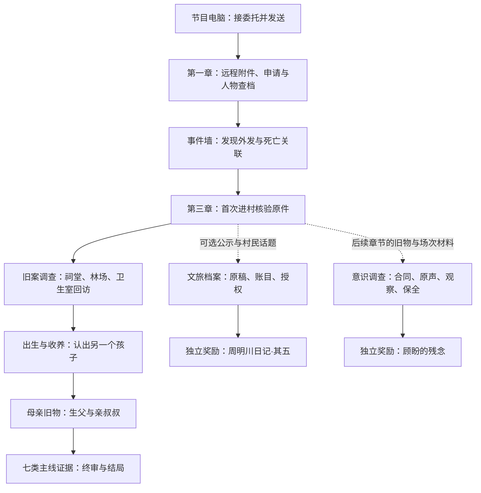

# 场景、画面与玩家流程设计初稿

作者审阅稿 v0.2 · 2026-09-09 · 全剧透。以现有中式动漫像素资产为基础，设计24个场景／界面单元，串联75份材料。编号是制作定位，不代表24张背景已全部制作。

[返回75份文档汇总](README.md) · [解谜判定和三级提示](13-puzzle-blueprint.md) · [世界观边界](00-worldbuilding.md)

当前搜索规则以[开放搜索设计](16-search-engine.md)为准：下文分章顺序为叙事路线，既存文章可以提前检索与阅读。

## 先看完整玩家路线

序章节目电脑（SC00，M01—03） → 第一章远程资料桌（SC09，M04—06） → 第二章事件墙（SC10，M07—09） → 第三章首次抵达盛家村（SC01，SC02—08走访/核验原件） → 祠堂旧照与户籍（SC11，M10—12） → 第四章林场与卫生室封存资料（SC12/08，M13—17） → 产房档案（SC13，M18—20） → 去向板与家庭相册（SC14/15，M21—24） → 母亲旧物与关系板（SC16，M25—26） → 终审报道（SC17）。

一轮基本操作是：进入画面 → 观察或交谈 → 得到允许/满足资料条件 → 放大原件 → 收入案卷 → 跨文档比较 → 提交结论 → 留下结果与下一入口。一次领取只给材料；关键结论仍由玩家完成。

HM从第三章首次进村后的公示和村民经营话题分出：SC18公示 → SC19空间/改稿 → SC20账目/授权 → SC23的RW01。另一路由旧物返还及异常场次进入SC21声音/观察 → SC22保全 → SC23的RW02。场景箭头是推荐游玩顺序，硬前置以X题制作单为准；尤其X02/X04并非RW01必做项。主线终审完全不依赖两路。

## 路线关系图

这张图用于看主支线关系；具体章节开放和材料条件以各场景及谜题制作单为准。

## 贯穿全程的搜索入口

[岭川搜寻](16-search-engine.md)嵌在节目电脑浏览器中，属于常驻工具，不另增剧情场景编号。SC00与SC09可从搜索进入来源页、职工网页和扫描申请；第三章后现场取得的姓名、馆藏号与版本号也能带回搜索。回看、筛选和收藏不改变第三章首次进村的门槛。

搜索当前已接入原16条资料/目录及调查档案，通过固定关键词映射打开文章/链接，不对正文模糊匹配；能看发布者、原始依据与同源转载。已有原始材料不按章节限制搜索摘要；外部原文URL暂留空。

## 画面和交互统一约定

- **美术**：环境与人物采用同一中式动漫像素语言。NPC用年龄、脸型、体态、头发、服装与职业动作区分；主角双胞胎保留亲缘相似和好看的面容。拒绝用低清模糊冒充像素风。
- **阅读**：场景保留像素轮廓，档案正文用清晰可缩放的中文排版。编号和图例必须实际存在于附件；文字检查视图提供与图像同等信息。
- **布局**：探索画面建议16:9，底部工具栏为地图、案卷、当前问题；对话从画面下部展开，关键手持物不被遮挡。检查档案时用居中大图和侧边来源信息，窄屏上下排列。
- **热点**：每个全景先安排2—4个有效观察点；首次指向/键盘聚焦有名称。提供“显示可交互处”，不靠搜一个像素卡关。拖拽均有点选替代。
- **对话**：日常话题 → 有依据的追问 → 出示已收档案 → 获准拍摄。NPC只知道本人经历和保管资料；年轻村民不替旧案作证。
- **反馈**：已领取可重读，重复领取不重复计数；失败指向缺失字段而非直接显示答案。收藏、翻阅、完成核验分别记录，新线索不要求重聊全部旧话题。
- **节奏**：每取得关键结论留一个短暂安静的阅读段，再提示下一问题。回访让熟悉画面增加少量合理附件，避免每章新造一间万能档案室。
- **边界**：作者稿展示所有剧透，游戏按章开放。成人双胞胎对照、母亲身份结论、教会片页都不出现在开场。奖励阅读位于游戏外层，不冒充陈默收到的证据。

## 当前完成度

75份正文与24个场景单元已接入游戏。新增调查流程接通学籍、后续发送、第二章事件墙、第三章出发、祠堂与林场旧案、出生收养及终审；HM两路独立奖励可选。下文的待制作视听资产仍保留制作要求，当前用现有像素场景和文字检查卡承接。没有新增系统解谜提示。

## 章节边界与出发动机

- 序章：普通寻人工作，完成第一位目标核验与发送；许的反馈让流程看上去正常。
- 第一章：所有必需材料都有远程来源。许补发照片、盛禾提供既存索引扫描和土地档案目录、玩家查学籍/公开网页。盛家村只在资料里反复出现，不开放地图和现场NPC，也不导向HM谜题。
- 第二章：仍留在电脑前，完成M07—09，保留玩家亲手外发第四名资料的记忆。C2-04记载暂停外发、保全/转交异常资料和联系第四名对象；调查动机转为“我把资料交给了谁”。
- 第三章：旧家庭原件没有完整扫描，保管处只回复调阅方式，玩家决定前往核验。出发清单列“投稿人身份依据、家庭旧照出处、相关历史户籍原页”，不写尚未证明的亲属关系。到村后才出现完整地图与六位NPC。
- 第四章：林场与卫生室封存夹进一步开放。第三章首次看见的空间此时可回访，新增材料和已知问题有明确关系。

制作时进村门槛应来自M07—09完成、C2-04处理记录和第三章出发动作，不来自N/H收集数量。当前代码的`chapterThreeStarted`为后续章节衔接预留；不能在序章消息中设置。旧存档保留档案和解题结果，但不继承旧版第一章进村权限。

## 场景目录

- [SC00 · 节目电脑：第一份寻人投稿](#sc00)
- [SC01 · 第一次抵达盛家村：地图与原件走访](#sc01)
- [SC02 · 旧邮亭：盛福根](#sc02)
- [SC03 · 杂货铺：钱素兰](#sc03)
- [SC04 · 旧学校值班室：邱映秋](#sc04)
- [SC05 · 祠堂外石阶：盛石生](#sc05)
- [SC06 · 便民服务室：盛禾](#sc06)
- [SC07 · 河桥：何小满](#sc07)
- [SC08 · 卫生室原件核验：熟悉资料第一次落到现场](#sc08)
- [SC09 · 远程资料桌：隔着屏幕寻找故人](#sc09)
- [SC10 · 事件墙：我把他们交给了谁](#sc10)
- [SC11 · 祠堂旧档阅读点：三口之家与第四个人](#sc11)
- [SC12 · 林场遗址与旧案复核桌](#sc12)
- [SC13 · 历史产房档案：两份活产记录](#sc13)
- [SC14 · 医院—村口—福利院：两日去向板](#sc14)
- [SC15 · 家庭群与生日相册：熟悉的物件](#sc15)
- [SC16 · 母亲旧物与关系板：名字回到人身上](#sc16)
- [SC17 · 终审与公开报道](#sc17)
- [SC18 · 村口公示栏：旅游是怎样进来的](#sc18)
- [SC19 · 旧图与展稿工作台：不存在的附房](#sc19)
- [SC20 · 运营档案桌：招牌、款项与授权](#sc20)
- [SC21 · 夜游后台资料回放：回应从哪里来](#sc21)
- [SC22 · 保全沙盘：停止强制角色](#sc22)
- [SC23 · 番外阅读：两份属于前作的余响](#sc23)

## SC00｜节目电脑：第一份寻人投稿

**状态**：已有序章交互；下列界面细化与像素物证待制作。

图示说明：盛德昌年轻／老年形象参考。不是1998年维修组合影；玩家须从不同来源分别取得照片，初访不直接展示这张对照板。

**进入条件**：开场进入节目后台，选题资料 → 本周投稿 → QT-073。

**构图与点击区域**：左侧投稿与目录，常驻浏览器可打开岭川搜寻；中间单份原件，右侧候选人物核验栏；底部仅在证据齐全时出现发送按钮。家庭群保留日常通知，不弹出主角成人头像。

### 玩家实际经过

1. 读P01，点击附件信封P02，翻面观察邮编残码；用P03补全435160（M01）。
2. 沿P04单位沿革打开职工网页P05；放大真实胸牌取得0717，再开P06通讯册。C1-08候选页此时可查，三项核对后生成P07（M02）。
3. 点击发送先展示收件人、具体资料和不可撤回说明；再次明确确认才产生P08（M03）。不预告后续死亡。

**反馈与防卡关**：缺哪项证据就标明哪项尚未核验，不把正确人名自动填入。成功回执常驻历史记录，许的短回复结束本段。

**出口与下一步**：[SC09 · 远程资料桌：隔着屏幕寻找故人](15-scene-flow.md#sc09)第一章远程寻人；不开放地图。

**需要制作**：信封正反面、邮编局部、厂队群像与可读胸牌、候选人物页、发送确认及回执界面。

### 在这个画面阅读或取得的初稿

- [P01 · 想找几位很多年没见的故人](02-prologue.md#p01)；点击：节目后台未处理投稿 → 正文与附件栏。
- [P02 · 旧信封背面与附件检视记录](02-prologue.md#p02)；点击：投稿附件信封 → 翻面/放大残码。
- [P03 · 一九九三年邮政投递区划调整表](02-prologue.md#p03)；点击：内部地方志检索 → 1993区划表的候选行。
- [P04 · 东岚农机厂改制登记摘录](02-prologue.md#p04)；点击：企业沿革检索 → 改制前后名称与日期。
- [P05 · 维修二组一九九八年合影及原图说明](02-prologue.md#p05)；点击：旧职工网页合影 → 可放大胸牌；对照板不代替群像。
- [P06 · 维修车间退休、调离人员通讯册](02-prologue.md#p06)；点击：退休人员通讯录.zip → 0717输入框 → 调离记录。
- [P07 · QT-073：盛德昌身份核验单](02-prologue.md#p07)；点击：三项身份核验槽 → 提交成功后生成单据。
- [P08 · QT-073：资料发送回执](02-prologue.md#p08)；点击：发送确认预览 → 明确确认 → 历史回执。

## SC01｜第一次抵达盛家村：地图与原件走访

**状态**：地图与六处NPC交互已保留，入口改为第三章；完整进村过场和第二章到第三章的剧情衔接待实装。

图示说明：现有探索地图。便民服务室尚缺独立清晰的建筑标识；节点位置是导航设计，不把插画当精确测绘图。

**进入条件**：第三章开场：已完成第二章死者核验、外发时间关联和第四名发送回看，保全并转交异常外发记录；随后决定实地核验许行远的身份。

**构图与点击区域**：下方村口与邮亭、左侧卫生室、中央巷道、上方祠堂、右上学校、右下石桥、左上林场。便民服务室用独立文字牌标注，后续补进地图画面。

### 玩家实际经过

1. 到达前在电脑生成“待核原件清单”，只列尚缺的来源和保管处；不提前显示家族答案。此前盛家村只作为地名、档案抬头和资料里的局部照片出现。
2. 先展示村口抵达画面，再由旧邮亭附近进入地图。当前目标是“核验投稿人与旧村档案的关系”，首访优先去服务室/学校询问保管处；可自由和其他村民交谈。
3. 从第三章开始开放六位NPC。卫生室可以核对第一章扫描件的原保管位置，祠堂内室由本章主线调阅开放；林场等第四章。地图访谈不重复计为M04—06必做题。

**反馈与防卡关**：锁定节点解释“后续旧案调查开放”；不让玩家误以为必须完成HM。地图可显示地点清单供键盘或窄屏选择。

**出口与下一步**：[SC06 · 便民服务室：盛禾](15-scene-flow.md#sc06)/[SC04 · 旧学校值班室：邱映秋](15-scene-flow.md#sc04)取得主线旧物调阅方向 → [SC11 · 祠堂旧档阅读点：三口之家与第四个人](15-scene-flow.md#sc11)；[SC02 · 旧邮亭：盛福根](15-scene-flow.md#sc02)—[SC08 · 卫生室原件核验：熟悉资料第一次落到现场](15-scene-flow.md#sc08)为可穿插走访，[SC18 · 村口公示栏：旅游是怎样进来的](15-scene-flow.md#sc18)为可选公示。

**需要制作**：地图服务室标识、章节节点状态、可访问地点清单、日夜氛围版本；不以真实时间限制访问。

## SC02｜旧邮亭：盛福根

**状态**：已有NPC图、对话和简版档案；路线叠图待制作。

图示说明：旧邮差、信件、邮筒与自行车构成入口画面。

**进入条件**：第三章首次进村后可访，不要求任何HM调查。

**构图与点击区域**：人物位于左前方；点击人物交谈。得到允许后在对话区出现路线册近看入口，右侧邮筒只补充生活描述。

### 玩家实际经过

1. 问“旧地址以前怎么投递”，盛福根解释旧称和收转区别。
2. 选“能拍一下路线页吗”，展开N01并收藏。首访不让他直接给出收件人身份。
3. 带N06回来可做X01旧图对齐；用石桥、邮亭两个稳定地标配对。

**反馈与防卡关**：路线页领取后显示已收入案卷；重复点击打开原页。对齐失败只指出地标尚未对应。

**出口与下一步**：[SC07 · 河桥：何小满](15-scene-flow.md#sc07)对齐当日路线；[SC06 · 便民服务室：盛禾](15-scene-flow.md#sc06)/[SC11 · 祠堂旧档阅读点：三口之家与第四个人](15-scene-flow.md#sc11)继续第三章主线。

**需要制作**：N01摊开册页、旧/新图图层、地标配对按钮。

### 在这个画面阅读或取得的初稿

- [N01 · 东岚支局乡邮投递路线摘页](01-npc.md#n01)；点击：人物对话中的“旧投递路线” → 获准后的路线册。

## SC03｜杂货铺：钱素兰

**状态**：已有NPC图与条件对话；账本特写待制作。

图示说明：钱素兰在柜台后，手下是合拢的账本；不是已经可读的N02账页。

**进入条件**：第三章到杂货铺；第一章已获索引卡扫描件可直接出示，不要求现场重新领取。

**构图与点击区域**：人物为主点击区，柜台账本为取得允许后的检查区；货架罐子不藏随机密码。

### 玩家实际经过

1. 先聊称呼，再出示已收到的索引卡。钱素兰说“你们电话里问的就是这张？原来的账我还留着。”
2. 她翻开两条原账，玩家核对简称和全名并拍摄N02。它为之前的寻人结论补原件旁证，不阻断第一章M04。
3. 第四章增加夜游结算话题，给H07日期入口；不知情的她不直接解释幕后组织。

**反馈与防卡关**：她只确认这两笔账中的同一人，不替玩家断言罗桂枝去向。夜游话题不要求先完成账目主线之外的其他X题。

**出口与下一步**：[SC11 · 祠堂旧档阅读点：三口之家与第四个人](15-scene-flow.md#sc11)当前旧案调查；第四章可选[SC21 · 夜游后台资料回放：回应从哪里来](15-scene-flow.md#sc21)。

**需要制作**：两条账页特写、遮住其他住户的纸张、翻页前后状态。

### 在这个画面阅读或取得的初稿

- [N02 · 杂货铺赊账本：卫生室代领摘页](01-npc.md#n02)；点击：第三章出示已收索引卡 → 钱素兰翻开账本原件。

## SC04｜旧学校值班室：邱映秋

**状态**：已有NPC图与简版目录；第三章原件核验和增页待扩充。

图示说明：银发辫、眼镜、相册与黑板；怀中相册目前合拢。

**进入条件**：第三章携第一章已核验的宣传照副本到访。

**构图与点击区域**：人物/手持相册是首访入口，右侧桌面是后期并排查看照片的位置；柜中其他资料只显示目录。

### 玩家实际经过

1. 请邱映秋核验SY95-06底片袋，取得N03；她解释拍摄日期与补字时间。此时是对线上材料的复核，不要求重做M04。
2. 本章主线提出旧物调阅请求后，按来源凭证查看C3-03/C3-04与家庭旧照增页；不要求H05或X02。
3. 可选询问“展板用的是哪一版”，领取H04采录和H05副本线索，去SC19比较。

**反馈与防卡关**：首次寒暄不主动说出“行远是次子”；家庭题字随对应旧照调阅出现。主线原件入口与可选目录收集分别开放。

**出口与下一步**：[SC11 · 祠堂旧档阅读点：三口之家与第四个人](15-scene-flow.md#sc11)主线旧照；可选[SC19 · 旧图与展稿工作台：不存在的附房](15-scene-flow.md#sc19)。

**需要制作**：底片袋正反面、分章目录增页、四人家庭旧照、旧采访录入页。

### 在这个画面阅读或取得的初稿

- [N03 · 村小活动相册目录：妇幼宣传底片袋](01-npc.md#n03)；点击：第三章携照片副本询问邱映秋 → SY95-06封套 → 主线调阅开放后看家庭旧照增页。

## SC05｜祠堂外石阶：盛石生

**状态**：已有NPC图和修缮档案；E-2现场对应图待制作。

图示说明：石匠坐在台阶上，工具、水桶与门框可作定位参照；画面仅是外部。

**进入条件**：第三章首次进村后可访；内室由同章主线调阅开放。

**构图与点击区域**：人物点击谈修缮，门框与石阶另设观察点；E-2定位标记要在正式近景中补画，不能假称现图已经标注。

### 玩家实际经过

1. 问修过哪里，获准拍N04的2008年工单。
2. 第三章携H03测绘底图回访，分别选门框固定端点和石阶转角，进行X04对齐。
3. 比较12m与9m，指出未解释的3m带宽；取得专项移交清单入口。

**反馈与防卡关**：算出空间差额只说明存在未列附房，不自动断言尸体或鬼。首次点门不会直接进入HM后台。

**出口与下一步**：[SC11 · 祠堂旧档阅读点：三口之家与第四个人](15-scene-flow.md#sc11)主线内室；[SC19 · 旧图与展稿工作台：不存在的附房](15-scene-flow.md#sc19)可选测绘。

**需要制作**：E-2门框近景、明确尺寸与墙厚的测绘图、游客图、工单局部。

### 在这个画面阅读或取得的初稿

- [N04 · 祠堂外墙与石阶修缮工单](01-npc.md#n04)；点击：盛石生对话 → 2008工单 → E-2门框观察点。

## SC06｜便民服务室：盛禾

**状态**：已有NPC图与来源表；后期查档工作台待制作。

图示说明：扫描设备、剪贴板、文件架与敞开的村巷门。现代资料整理现场，不是1995年场景。

**进入条件**：第三章才进入实体服务室。第一章与盛禾的联系仅在电脑文字/资料收件栏；完整N05等到访后领取。

**构图与点击区域**：人物解释来源，桌面进入扫描件目录，文件架显示可申请类别。主线申请与文旅公开资料各有清楚标题。

### 玩家实际经过

1. 初次见面，盛禾认出节目资料申请。玩家核对之前的扫描件来源；C1-06线上申请已完成，不重新索取同一材料当新谜题。
2. 问“许行远或盛长林家的旧档由谁保管”，取得主线调阅方向。此入口不以N05、其他N档案或HM完成度为前置。
3. 自选出示其他NPC材料可领N05；另外查H02会议记录，后续按章申请H03/H05/H10经手副本。

**反馈与防卡关**：资料不足时明确缺姓名、日期或编号中的哪一项；不会笼统要求“搜齐全部档案”。

**出口与下一步**：[SC11 · 祠堂旧档阅读点：三口之家与第四个人](15-scene-flow.md#sc11)核验旧户籍/家庭照；可选[SC19 · 旧图与展稿工作台：不存在的附房](15-scene-flow.md#sc19)/[SC20 · 运营档案桌：招牌、款项与授权](15-scene-flow.md#sc20)。

**需要制作**：带来源字段的目录、申请与到件状态、会议复印件、扫描原边。

### 在这个画面阅读或取得的初稿

- [N05 · 村庄旧资料来源与编号对照表](01-npc.md#n05)；点击：盛禾桌面扫描目录 → 来源与原件号标签。
- [H02 · 民俗游线试点村民议事记录](11-hm-tourism.md#h02)；点击：服务室公开记录目录 → 村民议事复印件。

## SC07｜河桥：何小满

**状态**：已有NPC图与路线档案；地图对照待制作。

图示说明：年轻快递员、包裹、自行车与石桥，承担当下的生活气息。

**进入条件**：第三章首次进村后可访，无其他档案前置。

**构图与点击区域**：点击人物谈路线；自行车包裹仅生活反馈；背后的石桥是新旧图共同地标。

### 玩家实际经过

1. 问今天哪些路能走，取N06。何小满只讲今天实走的情况，不给1995年目击口供。
2. 有N01时打开X01地图比对，获得便捷导航与额外日常对话。
3. 自选问夜游告示，提示村口公示位置；第四章可提供H07当日代投时间记录。

**反馈与防卡关**：路线题接受多条有效路线；不做X01仍能走到主线地点。

**出口与下一步**：[SC02 · 旧邮亭：盛福根](15-scene-flow.md#sc02)对图或[SC11 · 祠堂旧档阅读点：三口之家与第四个人](15-scene-flow.md#sc11)主线；[SC18 · 村口公示栏：旅游是怎样进来的](15-scene-flow.md#sc18)可选。

**需要制作**：当日路线图、通行图例、夜游日期附件。

### 在这个画面阅读或取得的初稿

- [N06 · 当日代投路线：河桥至村中巷道](01-npc.md#n06)；点击：何小满对话 → 当日通行路线页。

## SC08｜卫生室原件核验：熟悉资料第一次落到现场

**状态**：已有场景和检查热点；改为第三章原件核验，第四章封存夹待制作。

图示说明：现有卫生室场景。画中时钟与床下蓝白布不是本章密码或双胞胎物证；正式图需减少这些会误导玩家的细节。

**进入条件**：第三章首次到村后可进入；第四章获得旧案核查资格再增加封存资料夹。

**构图与点击区域**：左药柜12号与右书桌夹层对应第一章扫描件的原保管位置。已拿副本可以直接打开对照；原件检视单独记状态，不清除或重新锁住线上结论。

### 玩家实际经过

1. 第三章来到第一章只在资料里听过的卫生室，查看药柜与书桌。点击显示“核对原件”，比较纸张边缘、背面笔迹和扫描裁边。
2. 已核验姓名/去向不重新提交M04；可将原件对照收入案卷。没有拍摄原件也不阻断本章家庭照主线，缺少旧版扫描件时保留补阅。
3. 第四章回访新增来源清楚的C4-05封存夹。此时玩家已有举报线索，再比较伤情改写，回SC12事件复核。

**反馈与防卡关**：已搜索热点保留“再次查看”。关键文件开文字检查视图，像素小字不会造成读不清的卡关。

**出口与下一步**：第三章[SC11 · 祠堂旧档阅读点：三口之家与第四个人](15-scene-flow.md#sc11)；第四章[SC12 · 林场遗址与旧案复核桌](15-scene-flow.md#sc12)。

**需要制作**：12号抽屉近景、索引卡、宣传照正反面、封存夹、改写痕迹；清理无关时钟数字/布纹暗示。

### 在这个画面阅读或取得的初稿

- [C4-05 · 卫生室处置记录：改写前的伤情描述](06-chapter-four.md#c4-05)；点击：第四章卫生室桌旁新开放封存夹 → 原始痕迹与改写层。

第三章核验第一章材料原件：[C1-01索引卡](03-chapter-one.md#c1-01)、[C1-02宣传照](03-chapter-one.md#c1-02)。这两份材料的首次取得画面是SC09，不要求现场搜查后才可完成第一章。

## SC09｜远程资料桌：隔着屏幕寻找故人

**状态**：已接入第一章照片/扫描件接收与初步核验；学籍、退休名册、土地档案和后续发送仍待制作。

**画面提案**：待制作界面，以下是布局提案。

**进入条件**：序章发送盛德昌资料后，读许行远补充消息，留在节目电脑。前两章不开放村庄地图或现场NPC。

**构图与点击区域**：左侧投稿消息与资料申请记录，浏览器提供搜索结果、来源页和原文回溯；中间接收到的原件扫描/照片正反面，右侧姓名、年代、地点核验槽；源文件和提供人分栏。盛禾只出现资料联系署名，不提前展示服务室全景。

### 玩家实际经过

1. 许行远补发C1-02照片副本，玩家接收后翻背面。向资料联络员盛禾请求独立保存的C1-01扫描页；药柜12号标为原保管位置。先对全名和去向，再查C1-03学籍候选。
2. 按年龄/籍贯/外貌排除同名者；C1-04公开文章和9624打开C1-05退休名册，完成M04—05。N02/N03是第三章补原件的旁证，不是此前的必需材料。
3. 提出盛广财姓名后线上申请C1-06，按023户迁出方向查C1-07，用四项信息识别错字名（M06）。申请不要求去服务室或领取N05。
4. 将各人核验摘要写入C1-08，分别明确发送。章末读C1-09，再次亲手确认盛承安资料外发。前期接收和回执营造正常工作节奏，不提前放恐怖场景。

**反馈与防卡关**：错误提示指出冲突字段；投稿人的说法不能代替独立学籍/公共记录。远程回件可即时到达，无须等待现实时间；本作内置文章镜像。

**出口与下一步**：[SC10 · 事件墙：我把他们交给了谁](15-scene-flow.md#sc10)第二章事件墙；此时仍不能去[SC01 · 第一次抵达盛家村：地图与原件走访](15-scene-flow.md#sc01)。

**需要制作**：远程收件/申请及来源标签、宣传照正反面、索引卡扫描、学籍候选照、退休和象棋赛照片、023户申请回复、第三/第四次发送确认。

### 在这个画面阅读或取得的初稿

- [C1-01 · 卫生室借用与代领索引卡](03-chapter-one.md#c1-01)；点击：远程资料桌 → 盛禾的资料联系栏 → 申请并接收索引卡扫描件。
- [C1-02 · 一九九五年妇幼宣传照与背面题记](03-chapter-one.md#c1-02)；点击：许行远补充消息 → 接收宣传照副本 → 正反面查看。
- [C1-06 · 盛家村土地底册：023 户迁出登记](03-chapter-one.md#c1-06)；点击：远程申请 → 姓名对应的目录 → 023户迁出行。
- [C1-03 · 岭川卫生学校一九九六级学员名录](03-chapter-one.md#c1-03)；点击：学籍检索结果 → 年龄/籍贯/外貌候选卡。
- [C1-04 · 那些从岭川卫校走出去的人](03-chapter-one.md#c1-04)；点击：内置岭川旧影文章 → 旧照和后来任职段落。
- [C1-05 · 南岭退休医护志愿服务队名册](03-chapter-one.md#c1-05)；点击：文章附件 → 学号9624输入框 → 志愿服务名册。
- [C1-07 · 柳河老年象棋赛报名表及赛后合影](03-chapter-one.md#c1-07)；点击：地方活动网页 → 报名表与赛后合影并排。
- [C1-08 · 三位故人的公开履历核对页](03-chapter-one.md#c1-08)；点击：节目人物库 → 独立候选页/已核验页状态。
- [C1-09 · 许行远的补充留言：还有一个名字](03-chapter-one.md#c1-09)；点击：章末补充留言 → 盛承安资料预览 → 明确发送。

## SC10｜事件墙：我把他们交给了谁

**状态**：待制作。

**画面提案**：待制作界面，延续节目电脑的档案风格，不插入鬼影作为证据。

**进入条件**：第二章后台出现第一则新闻；玩家主动打开后汇集另外两则。

**构图与点击区域**：上：三则新闻与人物卡；中：三行各三张时间卡（发送/事件/报道）；下：第四名发送快照入口和结论栏。

### 玩家实际经过

1. 从C2-01各提取身份字段，与C1-08核验三名死者（M07）。
2. 将C2-02九张卡归入各人并排序，比较发送至事件的31/22/27小时；区分事件发生和新闻刊发（M08）。
3. 打开C2-03历史发送内容，亲眼看见盛承安资料也已外发（M09）。提交接收人共同点，生成C2-04。
4. 生成C2-04后先暂停继续外发、保全并转交记录，同时尝试联系盛承安；由旧资料保管处回复“相关原件须到场核验”推动第三章。进村不是继续替许寻人，也不替代求助。

**反馈与防卡关**：错误时指出某一来源时间未引用，不替玩家排好整墙。成功后取消普通寻人提示，置顶“核查投稿人许行远”；不新增倒计时强迫乱点。

**出口与下一步**：第三章出发过场 → [SC01 · 第一次抵达盛家村：地图与原件走访](15-scene-flow.md#sc01)首次进村 → [SC06 · 便民服务室：盛禾](15-scene-flow.md#sc06)/[SC04 · 旧学校值班室：邱映秋](15-scene-flow.md#sc04) → [SC11 · 祠堂旧档阅读点：三口之家与第四个人](15-scene-flow.md#sc11)。

**需要制作**：九张时间卡、新闻快照、来源跳转、异常外发记录、环境声渐弱的过场。

### 在这个画面阅读或取得的初稿

- [C2-01 · 三则地方简讯：荣川、南岭、柳河](04-chapter-two.md#c2-01)；点击：三则新闻卡 → 身份字段与已核验人物卡。
- [C2-02 · QT-073 发送记录与事件时间核对表](04-chapter-two.md#c2-02)；点击：事件墙 → 三行九张时间卡 → 时间差便笺。
- [C2-03 · 盛承安资料发送快照](04-chapter-two.md#c2-03)；点击：历史发送记录 → 第四名资料完整快照。
- [C2-04 · QT-073 异常外发情况记录](04-chapter-two.md#c2-04)；点击：异常外发结论栏 → 提交后生成记录。

## SC11｜祠堂旧档阅读点：三口之家与第四个人

**状态**：已有内室概念图；场景和旧物移交流程待制作。

图示说明：祠堂气氛参考。左侧示意合影不是C3-03真实四人家庭照；地板活板和右门不默认藏主线秘密。

**进入条件**：第三章首次进村，从服务室/学校问到旧物保管和调阅方向后开放；不要求收齐六份N档案。

**构图与点击区域**：建议将左侧桌面作为获准查看的旧物扫描件阅读点，中间供台只观察，右门为可选空间线索。家属旧物移交人尚未定名，须保留来源凭证。

### 玩家实际经过

1. 电脑得到C3-01三人户籍与C3-02报道，现场查看C3-03四人照并翻背（M10）。
2. 调取C3-04大学生文章，连上“长林家老二”和许行远（M11）。
3. 回电脑用锁外清查日期0826开C3-05附页，连018/042户，建立寄养关系（M12）。

**反馈与防卡关**：数出四人仅产生待核问题，成功关系必须有登记支持。直接主线原件路径不要求先对HM改稿。

**出口与下一步**：[SC12 · 林场遗址与旧案复核桌](15-scene-flow.md#sc12)旧案；可选[SC19 · 旧图与展稿工作台：不存在的附房](15-scene-flow.md#sc19)测绘/裁稿。

**需要制作**：1985年真实四人照正反面、原件移交凭证、1994升学旧照、可读登记页、内室桌面交互。

### 在这个画面阅读或取得的初稿

- [C3-01 · 盛家村 018 户人口登记摘页](05-chapter-three.md#c3-01)；点击：历史户号检索 → 018户成员行。
- [C3-02 · 盛家村火情简报：盛长林家三人遇难](05-chapter-three.md#c3-02)；点击：报刊镜像 → 三人遇难段落及原刊来源。
- [C3-03 · 四人家庭照：临川十三，行远十一](05-chapter-three.md#c3-03)；点击：旧物阅读点 → 有移交凭证的四人照 → 翻背面。
- [C3-04 · 一九九四年岭川考出去的大学生](05-chapter-three.md#c3-04)；点击：岭川旧影文章 → 升学旧照白边和学籍姓名。
- [C3-05 · 一九九二年人口清查表及补充核查页](05-chapter-three.md#c3-05)；点击：人口清查表表头 → 0826附页 → 018/042户对照。

## SC12｜林场遗址与旧案复核桌

**状态**：已有林场概念图；进入、录像和案卷工作台待制作。

图示说明：林场环境参考。树上017、地上录像器材、鞋与钉子尚无证据来源，均不能直接代替正式物证；正式场景应去除无意义编号或改为环境细节。

**进入条件**：第四章进入旧案调查后开放林场；合法调阅资料与留存录像有独立来源。

**构图与点击区域**：遗址全景负责空间理解；左侧旧岗亭看历史位置说明，右侧退出回地图。录像、举报与事故档案在案卷电脑打开，不写成玩家在废墟随手捡到全部原件。

### 玩家实际经过

1. C4-01两份独立记录核对林知微；C4-02按1028开附件，再用同收文号查C4-03（M13—14）。
2. 进入带来源说明的C4-06历史视频，拖到可见巡护牌帧；放大017并结合喊声、C4-07领用册确认盛临川（M15）。
3. 回访SC08拿C4-05；用C4-08/09专业复核分火前火后伤情（M16），再将C4-04车辆、C4-10底账和前述记录做偏序整理，生成C4-11（M17）。

**反馈与防卡关**：录像里的02:17是视频位置，不能由卫生室钟或树刻替代。允许逐帧静图与完整转写。现场荒凉负责情绪，责任结论来自交叉证据。

**出口与下一步**：[SC13 · 历史产房档案：两份活产记录](15-scene-flow.md#sc13)出生记录。

**需要制作**：有017真巡护牌的视频关键帧及3分40秒视频、字幕/喊声、值班表、车辆记录、专业复核分组板。

### 在这个画面阅读或取得的初稿

- [C4-01 · 林知微失踪登记与村内人物登记对照页](06-chapter-four.md#c4-01)；点击：案卷电脑双页 → 外地失踪档与村内人员登记。
- [C4-02 · 关于盛家村非法拘禁及买卖妇女情况反映](06-chapter-four.md#c4-02)；点击：县档收文目录 → 封面日期 → 1028正文附件。
- [C4-03 · 群众来信调阅与回转登记](06-chapter-four.md#c4-03)；点击：同收文号链接 → 调阅/回转两栏。
- [C4-04 · 东岚农机厂临时用车登记与司机补记](06-chapter-four.md#c4-04)；点击：厂车辆旧档 → 车次和司机补记；不是现场拾得。
- [C4-06 · 父亲留下的录像 04：一九九五年的东岚林场](06-chapter-four.md#c4-06)；点击：留存视频播放器 → 02:17附近关键帧/喊声转写。
- [C4-07 · 东岚林场巡护牌领用与值班表](06-chapter-four.md#c4-07)；点击：林场职工旧档 → 017领用人及值班日期。
- [C4-08 · 盛长林住宅火灾调查结论存档件](06-chapter-four.md#c4-08)；点击：历史事故档案 → 火灾结论与所引证据。
- [C4-09 · 未归档现场笔记与伤情复核摘录](06-chapter-four.md#c4-09)；点击：核验来源的留存副本 → 专业复核火前/火后分组。
- [C4-10 · 盛广财私人底账：未并入救济册的附页](06-chapter-four.md#c4-10)；点击：遗留资料移交附件 → 私账关联行与指令来源。
- [C4-11 · 一九九五年事件复核时间线](06-chapter-four.md#c4-11)；点击：八项事件偏序板 → 每条关联挂原件 → 提交生成。

## SC13｜历史产房档案：两份活产记录

**状态**：已有双婴概念图；医疗原件与可读标签待制作。

图示说明：两个摇篮的美术参考，尚无可读A/B编号。不是现成出生证明；此图最早在M19确认双份活产后完整展示。

**进入条件**：第五章先核对盛承安生日，证明他在旧案时尚未出生。

**构图与点击区域**：先显示登记封面C5-02；输入0708后出现A/B独立页签。中央对照两联，底部放出生、病亡附记和活体就诊三个日期槽。

### 玩家实际经过

1. C5-01生日对照旧案时间线，完成M18。
2. 打开C5-02两联，逐条找两名均有生命体征的记录；A/B编号为原件证据，婴儿脸不负责区分（M19）。
3. 把C5-04的7月15日病亡与C5-05的7月29日活体就诊并排，以LC-960708-12-B确认同一B（M20）。

**反馈与防卡关**：两个孩子的认知由玩家核验生成，不能在输入0708前用双婴封面剧透。21日龄与日期可辅助检查，但不能代替唯一编号。

**出口与下一步**：[SC14 · 医院—村口—福利院：两日去向板](15-scene-flow.md#sc14)转诊与福利院资料。

**需要制作**：产房封面、A/B独立原件、编号纸、单婴/双婴展示版本、病亡与就诊记录。

### 在这个画面阅读或取得的初稿

- [C5-01 · 盛承安出生资料与事件核查回复](07-chapter-five.md#c5-01)；点击：第四名目标补充身份页 → 出生日期与1995时间线。
- [C5-02 · 一九九六年七月八日产房登记](07-chapter-five.md#c5-02)；点击：历史产房登记封面 → 日期提示 → 附件入口。
- [C5-03 · 新生儿观察记录：A 联与 B 联](07-chapter-five.md#c5-03)；点击：0708打开的A/B页签 → 生命体征与独立识别号。
- [C5-04 · 村内人口附记：第二个孩子病亡](07-chapter-five.md#c5-04)；点击：村册附页 → B病亡时间行。
- [C5-05 · 县医院儿科就诊登记：出生二十一日](07-chapter-five.md#c5-05)；点击：医院历史记录 → 日期/陪同人/LC-960708-12-B副签。

## SC14｜医院—村口—福利院：两日去向板

**状态**：待制作；婴儿参考见SC13。

**画面提案**：这是历史资料推演界面，不是玩家穿越到1996年的可走动场景。

**进入条件**：第六章以C5-05就诊日期和B识别副签申请后续资料。

**构图与点击区域**：中间两列7月29/30日，三行村内/医院/福利院；A、B、林知微用代号卡表示，避免过早揭开成人身份。右侧保留原件。

### 玩家实际经过

1. C6-01与C6-02放置母亲和两婴；C6-04可凭7月29日+医疗副签独立申请，不等M22照片题。结合接收页，提出返回为另一个孩子的推断（M21）。
2. 读C6-03，放大床尾96-0729-17和毯纹，与接收页、医疗副签交叉核对（M22）。
3. 沿接收号打开C6-05临时照看/收养页，姓氏与儿童拟用姓名尚未开放；转家庭相册找独立依据。

**反馈与防卡关**：把B放回村内时显示“此处与接收登记冲突”，保留其余正确卡。毯子只作物品旁证，母亲动机标推断。

**出口与下一步**：[SC15 · 家庭群与生日相册：熟悉的物件](15-scene-flow.md#sc15)家庭群与旧照。

**需要制作**：福利院单婴照、真实床尾编号特写、蓝白毯纹样、两日地点板、跨机构编号连接。

### 在这个画面阅读或取得的初稿

- [C6-01 · 罗桂枝留存转诊条及出村登记](08-chapter-six.md#c6-01)；点击：就诊附件 → 转诊条 → 同日出村记录。
- [C6-02 · 盛雄户临时照看附记与次日返村记录](08-chapter-six.md#c6-02)；点击：村内杂项登记 → 两日地点板中的A和母亲。
- [C6-03 · 那些没有留下名字的孩子](08-chapter-six.md#c6-03)；点击：福利记忆文章 → 单婴照床尾编号及毯纹放大。
- [C6-04 · 岭川福利院无名婴儿接收登记](08-chapter-six.md#c6-04)；点击：申请检索页 → 7月29日+医疗副签；也可按照片编号复核。
- [C6-05 · 96-0729-17 临时寄养与正式收养移交册](08-chapter-six.md#c6-05)；点击：接收页后续去向 → 寄养与移交两页 → 家庭姓名核对框。

## SC15｜家庭群与生日相册：熟悉的物件

**状态**：已有童年形象参考；真实家庭生日照和聊天界面待制作。

图示说明：女主分支童年对照板：两侧是各自生活环境，不是双胞胎一起长大的合影。男主分支另用对应童年板。成品需分别制作主角家庭生日照。

**进入条件**：家庭群日常和主角单人生日照开场可读；第六章携收养资料回看。

**构图与点击区域**：左侧家庭群，中央六岁生日照，右侧姓名核对便笺；不将兄妹/兄弟对照板直接发在家庭群。近看蓝白毯保留两处可比纹样。

### 玩家实际经过

1. 从家人留言和照片题记核对陈建平、沈芸全名，在C6-05完成收养页核验（M23）。
2. 沿接收→寄养→收养链，把生日、家人姓名与本人资料对应；提交“这个孩子是我”（M24）。
3. 成功后才在作者设计的身份回顾中展示成人双胞胎对照；陈默仍活着，不增加主角已死反转。

**反馈与防卡关**：照片题记是初期生活细节，后期成为可复查证据。只认出同款毯子不通过；系统列出仍缺的链段。

**出口与下一步**：[SC16 · 母亲旧物与关系板：名字回到人身上](15-scene-flow.md#sc16)母亲短笺与最终关系。

**需要制作**：主角男女两版六岁生日照、养父母同框照/题记、家庭群早期与后期消息、毯纹近景、成年身份回顾。

### 在这个画面阅读或取得的初稿

- [C6-06 · 家庭群留言与陈默六岁生日照](08-chapter-six.md#c6-06)；点击：家庭群 → 六岁生日照/题记 → 养父母全名和物件近看。

## SC16｜母亲旧物与关系板：名字回到人身上

**状态**：已有林知微与双胞胎形象参考；短笺和关系交互待制作。

图示说明：林知微同龄前后状态参考，不代表她在2026年的照片。成品旧物页应按确切来源逐张展示。

**进入条件**：第七章已完成主角收养身份核验，检查盛承安留下的旧物附件。

**构图与点击区域**：左侧母亲短笺/原件出处，中间人物关系板，右侧证据栏。血缘、寄养、收养用不同线型和文字标签，不只靠颜色。

### 玩家实际经过

1. 读C7-01医疗材料，选择“登记父亲存疑”，不能仅据就诊史断言无血缘。
2. 用锁外题字与既有临川资料得到语义密码“临川”，打开C7-02，核验母亲对两个孩子的指认（M25）。
3. 引用C3-05、C5-03、C6-05、C7-02连边，确认盛临川是生父、许行远是亲叔叔，生成C7-03（M26）。

**反馈与防卡关**：错误亲属边提示应检查关系类型或来源；成功时才整理完整人物关系。给玩家停留阅读短笺的空间，不用突发惊吓盖过母亲的表达。

**出口与下一步**：[SC17 · 终审与公开报道](15-scene-flow.md#sc17)终审；任意已开放支线可稍后补做。

**需要制作**：手写短笺、压缩包锁外提示、分支人物关系图、证据来源卡、身份回顾页。

### 在这个画面阅读或取得的初稿

- [C7-01 · 盛雄生育就诊资料与日期核对页](09-chapter-seven.md#c7-01)；点击：限制查阅医疗摘录 → 证据强度选择栏。
- [C7-02 · 母亲旧物.zip：写给两个孩子的短笺](09-chapter-seven.md#c7-02)；点击：母亲旧物.zip锁外题字 → 临川 → 手写短笺。
- [C7-03 · 最终关系核对：两个孩子与许行远](09-chapter-seven.md#c7-03)；点击：关系板 → 血缘/寄养/收养边及证据引用 → 生成关系单。

## SC17｜终审与公开报道

**状态**：待制作。

**画面提案**：报道编辑器和证据抽屉是终章主要画面。

**进入条件**：主线七类证据齐全后开放，不检测任何H或RW收集数。

**构图与点击区域**：左侧E01七类证据目录，中央E02报道初稿，右侧事实/推断/待证标记和来源跳转。结尾操作需展示清楚具体后果。

### 玩家实际经过

1. 逐类核查来源及缺口，不把C4-11生成总结当作全部原件的替代。
2. 选择公开旧案时先预览报道及引用，明确确认后形成E02版本，按既有结局设计收束追凶与阻止伤害。
3. 通关后保留章节回看、村庄走访和番外阅读；补做HM不改写已经完成的主线结论。

**反馈与防卡关**：缺证指出对应主线材料和回访入口。R-17观察、教会片页、两篇番外均不塞入七类终审材料。

**出口与下一步**：主线结局；[SC18 · 村口公示栏：旅游是怎样进来的](15-scene-flow.md#sc18)—[SC23 · 番外阅读：两份属于前作的余响](15-scene-flow.md#sc23)可选补完。

**需要制作**：报道编辑器、七类证据抽屉、确认及完成状态、通关后继续调查入口。

### 在这个画面阅读或取得的初稿

- [E01 · QT-073 终审证据目录与复核意见](10-ending.md#e01)；点击：终审入口 → 七类主线证据抽屉和复核意见。
- [E02 · 公开报道初稿：盛家村旧案中被抹去的人](10-ending.md#e02)；点击：公开报道预览 → 逐段引用 → 明确选择后的报道版本。

## SC18｜村口公示栏：旅游是怎样进来的

**状态**：现有地图可定位；公示栏近景待制作。

图示说明：借现有地图定位村口。公示栏与巡检面板尚未在地图上画出，需要独立近景。

**进入条件**：第三章首次进村后，由何小满或盛禾提示，也可在村口主动查看；前两章不打开HM调查入口。

**构图与点击区域**：左侧H01修缮公示，中间游客游线，右下巡检说明折页；标题先讲村庄经营，不早放教会标志。

### 玩家实际经过

1. 读修缮与旅游安排，选择收藏H01或直接离开；不弹出强制支线任务。
2. 自选展开巡检说明，用完整0—9点划表译出210（X03）；提供静态分组，不用真实频闪。
3. 频道记入便笺，后续取得H07复核附件时才播放。另可去服务室查H02，听村民对经营的不同意见。

**反馈与防卡关**：解出频道只是设备索引，不提前弹出原声或R-17真相。关闭支线仍显示主线当前目标。

**出口与下一步**：[SC19 · 旧图与展稿工作台：不存在的附房](15-scene-flow.md#sc19)空间/文本调查，或回[SC01 · 第一次抵达盛家村：地图与原件走访](15-scene-flow.md#sc01)。

**需要制作**：公示栏全景与可读附页、旅游图、巡检静态时序、频道记录状态。

### 在这个画面阅读或取得的初稿

- [H01 · 盛家村旧村修缮与民俗游线试点公示](11-hm-tourism.md#h01)；点击：村口公示栏 → 修缮公示/游线图/巡检折页。

## SC19｜旧图与展稿工作台：不存在的附房

**状态**：可复用学校/服务室场景；全部图稿交互待制作。

图示说明：石阶与门框是测绘回访参照；本图不是已标注的测绘底图。

**进入条件**：第三章起查阅旧图、采访和同源稿件，自选进入。

**构图与点击区域**：工作台左半原件，右半游客版；顶部在“测绘”“照片”“讲解稿”切换。原始版本分开放，比较结论等玩家提交后出现。

### 玩家实际经过

1. X04比较H03与N04：对齐固定点、读比例及墙厚，定位3m带宽附房。
2. X02按N03/N05馆藏号比C3原图与H05裁图；X05同时查H02意见、N04封门年与讲解稿v1/v3，标三种改写。
3. H04采访呈现旧规如何约束具体的人；不将民俗抄页变成必须照做的仪式。取得H06移交入口或继续查H08结算。

**反馈与防卡关**：每项差异要求原文与来源，不凭一张阴森画面推断组织。X02/X04可选，不能强制成为RW01额外前置。

**出口与下一步**：[SC20 · 运营档案桌：招牌、款项与授权](15-scene-flow.md#sc20)组织档案；H06也可由物主返还申请独立取得 → [SC21 · 夜游后台资料回放：回应从哪里来](15-scene-flow.md#sc21)/[SC22 · 保全沙盘：停止强制角色](15-scene-flow.md#sc22)。

**需要制作**：1:100实测图、游客删改图、同源照片裁边、v1/v3讲解稿、审批链、采访底稿。

### 在这个画面阅读或取得的初稿

- [H03 · 一期建筑测绘底图与夜游导览图差异单](11-hm-tourism.md#h03)；点击：测绘工作台 → 实测图与游客图叠放 → E-2区域。
- [H04 · 村中旧规抄页与民俗采录说明](11-hm-tourism.md#h04)；点击：邱映秋采访底稿 → 旧规与受访人语境；在工作台比较。
- [H05 · 《归灯夜行》讲解稿第三版与撤回段落](11-hm-tourism.md#h05)；点击：学校展陈目录/盛禾经手副本 → v1/v3与审批链。

## SC20｜运营档案桌：招牌、款项与授权

**状态**：可复用盛禾场景；账目和授权界面待制作。

图示说明：以服务室资料桌作为申请和接收经手副本的地点，不将盛禾写成掌握全部秘密的人。

**进入条件**：第五至六章可查专项结算；此路线可以独立于意识调查完成。

**构图与点击区域**：三个标签为结算流水、主体授权、接续清单；每页保留全名、日期、编号和来源。

### 玩家实际经过

1. X08从H08按批次/交易号连三笔18000、9600、7200，合计34800，排除普通经营工资。
2. X09打开H09/H10，核对全名、授权范围和接续日期，区分冻结历史委托与村内延续项目。
3. X05、X08、X09全部完成时显示RW01解锁提示，按钮“现在读/稍后读”。不要求R-17路线。

**反馈与防卡关**：同为HM缩写不判同一法人；冻结的HM-W-251206-117只能看历史附件，不能发起执行。

**出口与下一步**：[SC23 · 番外阅读：两份属于前作的余响](15-scene-flow.md#sc23)读RW01，或返回当前主线。

**需要制作**：结算原始凭证、资金连线界面、三主体授权页、冻结订单/现行项目对照、奖励提示。

### 在这个画面阅读或取得的初稿

- [H08 · 专项结算表：保管、校准与内容复核](11-hm-tourism.md#h08)；点击：经营/专项账标签 → 原始凭证和交易号连线。
- [H09 · 供应商关联附件：恒目、恒慕与乡村项目](12-hm-consciousness.md#h09)；点击：核验结算编号 → 供应商附件 → 三主体授权范围。
- [H10 · 二〇二六年运营接续与历史材料保全交接单](12-hm-consciousness.md#h10)；点击：盛禾经手副本 → 运营接续与专项保留两清单。

## SC21｜夜游后台资料回放：回应从哪里来

**状态**：待制作；不使用祠堂概念图冒充已有后台实景。

**画面提案**：拟新增安静的后台工作台：设备机柜、旧物保管格、记录夹；只回放历史记录，不给R-17画确定人脸。

**进入条件**：第四章取得H06/H07；第六章取得H11后深入。两条入口来自物主返还申请和异常场次记录，不必先做资金题。

**构图与点击区域**：上方双时钟日志，中间三条声轨及同等转写，下方四张历史观察卡；保管格显示物品标签，不直接写意识真名。

### 玩家实际经过

1. X06比H06物主联2/2与扫描联3/3，核对W-17→BG-017→R-17每段交接；可在本路线任意合适时点完成。
2. X07用同次铃响校正手持钟快3分钟，确认回应在演员离场21分钟后。携X03的210索引进入X10，对齐H07/H11原始/发布声轨，找删去的“我不是来接客的”。
3. X11读H12四次既往观察，比较A/B、B/C、C/D，标出单变量和来源独立性；完成才开放H13教会片页。

**反馈与防卡关**：所有声音线索都能在文字轨完成。不强迫戴耳机或执行新仪式；误判“声音像顾盼”不会通过身份核验。确认操纵意识的世界观仍保留能力限制。

**出口与下一步**：[SC22 · 保全沙盘：停止强制角色](15-scene-flow.md#sc22)；也可保存进度返回主线。

**需要制作**：后台新场景、保管物与三段标签、校准日志、独立声轨和转写、四轮观察卡、H13残页。

### 在这个画面阅读或取得的初稿

- [H06 · 旧物借展与特殊保管补充约定](11-hm-tourism.md#h06)；点击：物主返还申请或H03移交入口 → 两联合同及交接链。
- [H07 · 夜游试运营排班、入场与设备记录](11-hm-tourism.md#h07)；点击：结算/代投日期线索 → 异常场次附件 → 校准日志和210索引。
- [H11 · 专项回访岗位说明：角色一致性与原始回应](12-hm-consciousness.md#h11)；点击：历史培训附件 → 发布/原始声轨和越界回应规则。
- [H12 · R-17 原始观察记录：声音为何改变](12-hm-consciousness.md#h12)；点击：完成声音来源核验 → A/B/C/D历史观察卡。
- [H13 · 教会观察片页：未结关系与回返窗口](12-hm-consciousness.md#h13)；点击：完成观察条件核验 → 教会片页及来源说明。

## SC22｜保全沙盘：停止强制角色

**状态**：待制作。

**画面提案**：在同一后台资料界面打开独立沙盘，不暗示已经接入现实后台或能删除玩家存档。

**进入条件**：X06对象链与X11观察条件已完成，H11岗位说明已读；无需主线通关。

**构图与点击区域**：左边目标链与保全清单，中间角色绑定/自动续建两个独立开关，右边当前批次与下一批次核验。

### 玩家实际经过

1. 打开H14申请联，选R-17并核对W-17/BG-017来源；先确认独立副本已保全。
2. 停止强制角色绑定，关闭自动续建，保留原物和关系记录；允许在沙盘撤销误选。
3. 检查下一批次未重建，五项核验齐全生成停止回执，X12完成；连同X10/X11解锁RW02。

**反馈与防卡关**：只静音会显示仍在绑定；只停止当前任务会显示续建未关闭。错误不毁原物、不清存档；结果不证明R-17就是顾盼或盛临川。

**出口与下一步**：[SC23 · 番外阅读：两份属于前作的余响](15-scene-flow.md#sc23)读RW02；可直接退出回主线。

**需要制作**：申请/回执两联、五项状态、下一批次日志、撤销与返回按钮。

### 在这个画面阅读或取得的初稿

- [H14 · R-17 关系保留申请与任务停止回执](12-hm-consciousness.md#h14)；点击：保全沙盘 → 申请联 → 五项核验 → 停止回执。

## SC23｜番外阅读：两份属于前作的余响

**状态**：已有两篇文字初稿；阅读器与配图待制作。

**画面提案**：独立阅读页，暂用排版营造气氛。周明川工具柜纸页、顾盼画展门口的像素插图尚未制作，不拿本作角色照片代替。

**进入条件**：分别达成RW01或RW02各自条件；两篇互不解锁，不要求前作存档。

**构图与点击区域**：顶部作品与人物背景短注，中间完整文章，下方阅读进度/返回。目录只显示各篇状态，不显示主线必需线索数量。

### 玩家实际经过

1. RW01提示周明川身份；说明其五为本次收录序号，写作时间为2026年5月30日，非死后续写。
2. RW02简短介绍顾盼，直接阅读画展、记忆与选择的段落；不把第一人称残念当作盛家村口供。
3. 可稍后读、反复读，退出回到进入前的主线或支线页面。

**反馈与防卡关**：打开即得到全文，不再输入密码；不自动收藏为调查证据。两篇配音若制作，也保留完整文字版。

**出口与下一步**：返回原场景或通关后菜单。

**需要制作**：两篇完整排版、人物背景短注、独立解锁状态、可选工具柜/画展插图与配音。

### 在这个画面阅读或取得的初稿

- [RW01 · 周明川日记·其五：不在这栋楼里](14-bonus-articles.md#rw01)；点击：番外阅读目录 → 独立解锁的周明川文章。
- [RW02 · 顾盼的残念](14-bonus-articles.md#rw02)；点击：番外阅读目录 → 独立解锁的顾盼文章。

## 素材补齐与制作顺序

以下按“能否支撑玩家操作”排优先，不将已有形象板计作成品物证。全部新增附件的必埋内容仍以各文档制作单为准。

1. **先做序章和第一章闭环**：信封正反面、厂队合影0717胸牌、药柜卡、宣传照背面、学籍及退休群像；补远程收件/申请的独立来源。先验证电脑内能领取、引用和继续，不放现场热点。
2. **先接第二章再做第三章首次进村**：补保管处回件、出发清单、村口抵达、6份NPC实物近景与地图服务室标识；随后制作主线反转物证：三组新闻与九时间卡、四人家庭照白边、1994升学照、举报流转、017录像及字幕、专业复核摘录。这批每件要带来源和年代，禁止从场景概念图截一块就充当证据。
3. **补双胞胎与收养链**：A/B原件、LC-960708-12-B副签、福利院单婴照96-0729-17、两处一致毯纹、主角男女家庭生日照、母亲短笺。成人/童年对照板留给美术和揭晓后回顾，玩家物证另制。
4. **完成终章可交付**：关系板、七类证据目录、报道预览、结局回看；先验证不做任何HM也能完成原有最佳结局。
5. **加入可选生活与经营调查**：旧/新路线、带尺寸E-2图、采访、v1/v3差异稿、合同两联、交易凭证。每份至少有“未核验原件”和“核验后结果”两种显示状态，不能初见就送答案。
6. **最后制作意识与奖励表现**：后台新场景、三声轨/等价转写、四轮观察卡、保全沙盘、两篇番外阅读器。RW01工具柜、RW02画展插图按前作人物和空间另作，不复用盛家村人物代替。

### 图中需要先消除的误读

- 卫生室钟面02:17和床下蓝白布：不是录像定位提示，也不是主角童年针织毯；正式美术需调整，当前图标为概念参考。
- 林场树刻017：巡护身份必须从带来源的录像胸牌和领用表得到；树刻不能替代它。
- 祠堂示意照片、四把椅子、地板活板：目前没有相应证据意义，不能让玩家靠它们推断四口之家或强迫下地道。
- 新生儿图无可读编号，童年板是两处不同环境，成人板是关系对照：三类都不是可直接投放的原始档案照片。
- 村庄地图缺服务室独立标识；实际测绘题必须另画带尺寸原件，不在探索插画上量像素求米数。

### 审阅时可以直接修改

每个场景可改构图、话题、氛围、进入方式及原件摆放；每份正文可改语气和生活细节。若改关键日期、身份主键、编号或来源关系，请同步对应制作单和谜题蓝图。场景编号、文档编号保留，便于后续把确认稿落实到游戏。

## 2026-09-09 补充：香火与生计

SC02 盛福根新增求子往事话题，查看 V01 修堂旧记；SC03 钱素兰新增香期生意话题，查看 V02 收支摘册；SC05 祠堂外盛石生补充供香与摆摊共用空间的见闻。人物先在场景中出现，点击后对话，再从当前话题进入文档阅读器；关闭文档返回对话。全文与材料对照制作单见 [17-village-faith.md](17-village-faith.md)。新话题没有原有借阅前置，也不推进 HM 或主线步骤。
