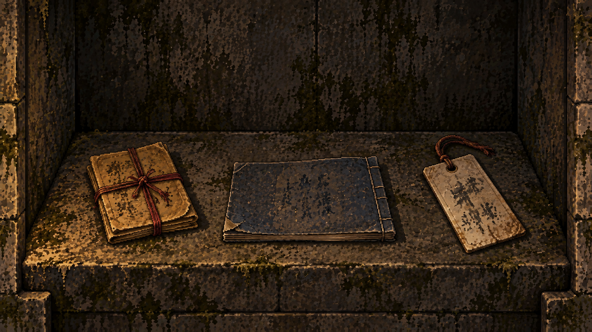

# 壁内暗格：物件与回访（作者制作记录）

2026-09-09，接续“继续丰富情节和交互”。此页为作者说明，不进入玩家正文。

## 可玩流程

1. 重访佛堂，鬼佛四手机关照原规则开启石板。近景或全景均可点击暗格开口。
2. 新的全屏暗格画面中有三件实物。直接点画面上的物件进入检视，支持键盘 Tab／Enter。
3. 检视显示对应材料的正面或背面。翻面后看到另一面内容；每面可单独拍摄，两面拍全收入案卷。打开“整理全文”只阅读，不自动拍摄或收藏。
4. 可以写个人笔记，输入即保存，最长 2000 字符。笔记不被程序判作答案，也不触发调查步骤。
5. 点击“放回”返回物件画面，右上角关闭离开暗格。通过石手机关进入暗格时，关闭返回石手；通过佛堂全景进入则返回全景。全文阅读器关闭返回当前物件，Escape 逐层退出。
6. 收藏对应材料后，场景内点击村民会多出出示材料的话题。现场照片和公开扫描件都能用于出示；不需要先领取某份 NPC 借阅档案。

| 实物 | 材料 | 回访人物 | 与旧材料的联系 |
| --- | --- | --- | --- |
| 左侧红线纸包 | V03 续灯愿纸与留堂批注 | 盛福根 | V01 的私人求嗣、V02 未到账愿款；背面无署名，不能擅自认证笔迹 |
| 中间复写旧本 | V04 雨日停摊退费存根 | 钱素兰 | V02 公用收支与摊户风险、H02 后来的结算要求；申请不等于已退 |
| 右侧穿绳纸签 | V05 佛堂壁内旧物查验签 | 盛石生、盛禾 | H03 旧结构与新测绘、H06 标签／物件／位置的保管关系 |

## 叙事边界

- 盛守安的求嗣和村民的生意诉求并存。村民不是共同知晓旧案的同一群体，盈利、损失、记忆和沉默各不相同。
- 1993 年文书属于创作暂拟；正文不能据求愿推断医学事实、怀孕原因或人物血缘。背面不署名就保留不确定性。
- 2021 年 HM 是后来的改造与保管方，不据新标签倒推暗格为 HM 建造，也不让其替旧案责任人承担所有因果。
- 绳结朝向差异只呈现记录，不自动认证超自然原因。前作奖励条件不变。
- 不把机关密码、解法、作者备注或关键词建议写进玩家界面。新材料的正反面本身是可见物证信息；正文通过编译器取得，不另维护一套内容。

## 存档与搜索

- `scenePuzzles.ghostHands` 保持原结构，原有手势和开启状态不会重置。
- `sceneEvidence.photos` 以 V03／V04／V05 为键，保存 `front`／`back`；去重后两面齐全才调用现有收藏流程。
- `sceneEvidence.notes` 保存自由笔记，渲染时进行 HTML 转义。
- `storyProgress.collected` 决定是否能出示副本，`npcTopics` 保存回访记录；原始材料的可搜索性不依赖这两个字段。
- 搜索收藏不会制造现场照片。原件留在画面，摄影不移走实物；不开辟新的主线门槛。
- 另一同源标签重置机关或撤销进村状态后，暗格关闭，不能继续记录照片。

## 素材与验证

近景由内置 image_gen 参照既有石手机关图生成，保持旧金、灰石、暗色像素质感。最终文件：`assets/pixel/environments/shrine-compartment-v1.png`；原始生成文件保留。完整提示词见 [shrine-compartment-prompt.txt](shrine-compartment-prompt.txt)。

40 项 DOM 回归覆盖原有主线发布、两篇独立奖励、搜索、机关，以及新增逐面拍摄、嵌套阅读、笔记安全与持久保存、回访话题和跨标签撤销。真实 Chrome 使用隔离存档鼠标完成机关，再检查三件物证、四名村民、关闭与 Escape、刷新和窄屏显示，不修改作者游戏存档。
